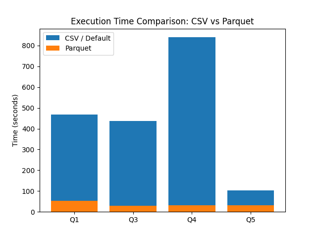

# NY Taxi Spark Analytics

Big Data Analytics project using Apache Spark and Hadoop on the NYC Yellow Taxi dataset.

## Technologies

- Apache Spark (RDD, DataFrame, SQL)
- Hadoop (HDFS)
- Parquet (partitioned datasets)
- Spark SQL Optimizer
- Python

---

## Dataset

- NYC Yellow Taxi dataset
- Years used:
  - 2015 dataset
  - 2024 dataset

Data stored in:
HDFS → Parquet (partitioned by pickup_date)

Partitioning enables:

- Partition pruning
- Faster query execution
- Reduced I/O

---

## Queries Implemented

### Q1 — Trips per Hour

For the 2015 dataset:

- count(*) as Trips
- avg(duration_minutes)
- 90th percentile of Haversine distance

Filters:

- valid coordinates
- non-zero duration

---

### Q2 — Top-K Dates by Tip per Mile

For each VendorID:

avg_tip_per_mile = tip_amount / trip_distance

Filters:

- trip_distance > 0
- fare_amount > 0

Implemented using:

- RDD
- DataFrame
- SQL (window functions)

---

### Q3 — Borough Flow Analysis

Flow:
PickupBorough → DropoffBorough

Steps:

- Join with taxi_zone_lookup twice
- Exclude same borough trips
- Return Top-K flows

Executed on:

- CSV
- Parquet

Comparison includes:

- Execution time
- Physical plan
- Partition pruning

---

### Q4 — Payment and Tip Analysis

Per PickupBorough:

- total Trips
- card_share
- avg_tip_rate_card

---

### Q5 — Zone Imbalance Detection

Formula:

imbalance = max(pickups, dropoffs) / max(1, min(pickups, dropoffs))

Used to detect:

- traffic skew
- asymmetric flows

---

### Q6 — Revenue and Fees Analysis

Per:

VendorID + service_zone

Metrics:

- Trips
- TotalRevenue
- CongestionAirport
- Share
- AvgRevenuePerTrip

---

## Performance Optimization

### Partition Pruning

Dataset partitioned by:

pickup_date

Spark applies:

PartitionFilters

Result:

- Faster execution
- Reduced scanning

## Execution Time Comparison (CSV vs Parquet)

The following table presents the execution times of the implemented queries using CSV (or default) and Parquet formats. The results demonstrate the performance benefits of columnar storage and query optimization techniques such as partition pruning and broadcast joins.

| Query | CSV / Default Time (sec) | Parquet Time (sec) | Speedup |
|------|---------------------------|--------------------|--------|
| Q1 | 468 | 54 | 8.7× |
| Q2 | — | 186 | — |
| Q3 | 438 | 30 | 14.6× |
| Q4 | 840 | 32 | 26.3× |
| Q5 | 102 | 32 | 3.2× |
| Q6 | — | 78 | — |

## Performance Comparison

---

### Join Strategy Analysis

Two experiments performed:

#### Broadcast Join

BroadcastHashJoin

Used when:

- lookup table is small

#### SortMerge Join

SortMergeJoin

Used when:

spark.sql.autoBroadcastJoinThreshold = -1

Comparison includes:

- Physical plan
- Execution time

---

## Project Structure

src/
data_preparation/
optimizer/
q1/
q2/
q3/
q4/
q5/
q6/

---

## Author

Dimitrios Tzounidis, AM: 2121241
